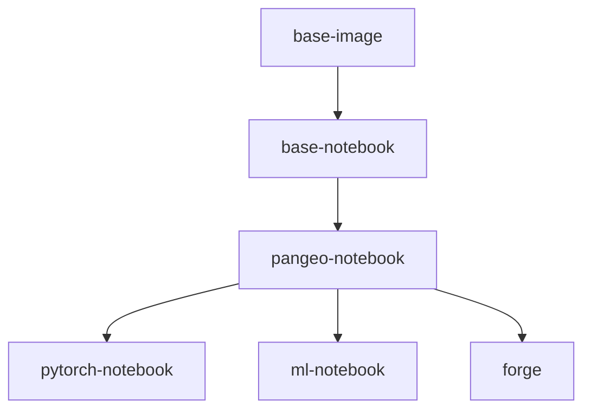

# Pangeo Docker Images

The images defined in this repository capture reproducible computing environments used by [Pangeo Cloud](https://pangeo.io/cloud.html). They build on top of the Ubuntu operating system and include [conda environments](https://conda.io/projects/conda) with a curated set of Python packages for geospatial analysis. While initially intended for Pangeo Cloud, they can be used outside of Pangeo infrastructure too!

More details can be found in [our documentation](https://pangeo-docker-images.readthedocs.io).

Images are hosted on [DockerHub](https://hub.docker.com/u/pangeo) and on [Quay.io](https://quay.io/organization/pangeo)

| Image           | Description                                   |  Size | Pulls |
|-----------------|-----------------------------------------------|--------------|-------------|
| base-image      | Foundational Dockerfile for builds            |  | 
| [base-notebook](base-notebook/packages.txt) | minimally functional image for pangeo hubs |  | 
| [pangeo-notebook](pangeo-notebook/packages.txt) | base-notebook + core earth science analysis packages |  | 
| [pytorch-notebook](pytorch-notebook/packages.txt) | pangeo-notebook + GPU-enabled pytorch |  | 
| [ml-notebook](ml-notebook/packages.txt) | pangeo-notebook + GPU-enabled tensorflow2 |  | 
| [forge](ml-notebook/packages.txt) | pangeo-notebook + [Apache Beam](https://beam.apache.org/) support|  | 

*Click on the image name in the table above for a current list of installed packages and versions*

### Other notes

* Since 2020.10.16, [mamba](https://github.com/mamba-org/mamba) is installed into the base-image and conda-lock environment and is used by default to solve for a compatible environment (see #146)
* For a simple list of packages for a given image, you can use a link like this: https://github.com/pangeo-data/pangeo-docker-images/blob/2020.10.08/pangeo-notebook/packages.txt
* To compare changes between two images, you can use a link like this: https://github.com/pangeo-data/pangeo-docker-images/compare/2020.10.03..2020.10.08
* Our `ml-notebook` image now contains JAX and TensorFlow with XLA enabled. Due to licensing issues, conda-forge does not have `ptxas`, but `ptxas` is needed for XLA to work correctly. Should you like to use JAX and/or TensorFlow with XLA optimization, please install `ptxas` on your own, for example, by `conda install -c nvidia cuda-nvcc`. At the time of writing (October 2022), JAX throws a compilation error if the `ptxas` version is higher than the driver version. There does not exist an easy solution for K80 GPUs, but in the case of T4 GPUs, you should install `conda install -c nvidia cuda-nvcc==11.6.*` to be safe. Alternatively for any GPU, you could set an environment variable to resolve the error caused by JAX: `XLA_FLAGS="--xla_gpu_force_compilation_parallelism=1"`. The aforementioned error will be removed (and likely turned into a warning) in a future version of JAX. See https://github.com/google/jax/issues/12776#issuecomment-1276649134

### Dask-gateway compatibility

The primary use of these Docker images is running on Pangeo Cloud deployments with [dask-gateway](https://github.com/dask/dask-gateway). Generally, the dask-gateway library version built into the image must match the dask-gateway version deployed in the cloud environment. The follow table keeps track of the first time a new dask-gateway version appears in a tagged image:

| dask-gateway |  Image tag  |
|--------------|-------------|
| 0.9          | 2020.11.06  |
| 0.8          | 2020.07.28  |
| 0.7          | 2020.04.22  |
