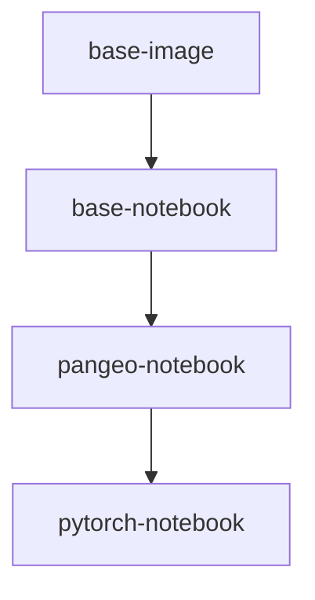

# Pangeo Docker Images

The images defined in this repository capture reproducible computing environments used by [Pangeo Cloud](https://pangeo.io/cloud.html). They build on top of the Ubuntu operating system and include [conda environments](https://conda.io/projects/conda) with a curated set of Python packages for geospatial analysis. While initially intended for Pangeo Cloud, they can be used outside of Pangeo infrastructure too!

More details can be found in [our documentation](https://datalabs-docker-images.readthedocs.io/en/latest/).

Images are hosted on [Dockerhub](https://hub.docker.com/u/cnes)

| Image           | Description                                   |  Size | Pulls |
|-----------------|-----------------------------------------------|--------------|-------------|
| base-image      | Foundational Dockerfile for builds            |  | 
| [base-notebook](base-notebook/packages.txt) | minimally functional image for pangeo hubs |  | 
| [pangeo-notebook](pangeo-notebook/packages.txt) | base-notebook + core earth science analysis packages |  | 
| [pytorch-notebook](pytorch-notebook/packages.txt) | pangeo-notebook + GPU-enabled pytorch |  | 

*Click on the image name in the table above for a current list of installed packages and versions*

### Using the image with Singularity on HPC systems

If you want to use this image on an HPC system (including a GPU system), we recommend using Singularity. Please see the [Singularity guide](Sing+GPU.md).

### Dask-gateway compatibility

The primary use of these Docker images is running on Pangeo Cloud deployments with [dask-gateway](https://github.com/dask/dask-gateway). Generally, the dask-gateway library version built into the image must match the dask-gateway version deployed in the cloud environment. The follow table keeps track of the first time a new dask-gateway version appears in a tagged image:

| dask-gateway |  Image tag  |
|--------------|-------------|
| 0.9          | 2020.11.06  |
| 0.8          | 2020.07.28  |
| 0.7          | 2020.04.22  |

### Additions in the Fork

* Installation processes for more complex applications can be managed using custom scripts, as described in the [Customization guide](docs/howto/custom-image.md). 

### Other notes

* Since 2020.10.16, [mamba](https://github.com/mamba-org/mamba) is installed into the base-image and conda-lock environment and is used by default to solve for a compatible environment (see #146)
* For a simple list of python packages for a given image, you can use a link like this: https://github.com/CNES/datalabs-docker-images/blob/master/pangeo-notebook/packages.txt
* For a simple list of apt packages for a given image, you can use a link like this: https://github.com/CNES/datalabs-docker-images/blob/master/pangeo-notebook/apt.txt
* To compare changes between two images, you can use a link like this: https://github.com/CNES/datalabs-docker-images/compare/2020.10.03..2020.10.08
