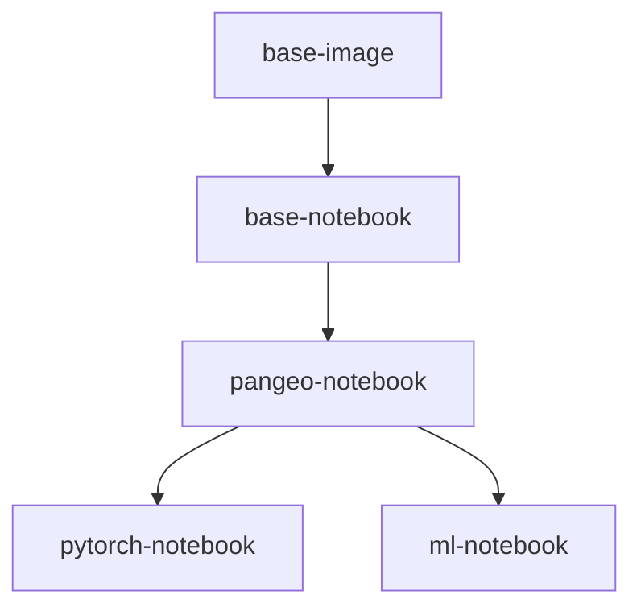

# Pangeo Docker Images

The images defined in this repository capture reproducible computing environments used by [Pangeo Cloud](https://pangeo.io/cloud.html). They build on top of the Ubuntu operating system and include [conda environments](https://conda.io/projects/conda) with a curated set of Python packages for geospatial analysis. While initially intended for Pangeo Cloud, they can be used outside of Pangeo infrastructure too!

More details can be found in [our documentation](https://pangeo-docker-images.readthedocs.io).

Images are hosted on [DockerHub](https://hub.docker.com/u/pangeo) and on [Quay.io](https://quay.io/organization/pangeo)

| Image           | Description                                   |  Size | Pulls |
|-----------------|-----------------------------------------------|--------------|-------------|
| base-image      | Foundational Dockerfile for builds            |  | 
| [base-notebook](base-notebook/packages.txt) | minimally functional image for pangeo hubs |  | 
| [pangeo-notebook](pangeo-notebook/packages.txt) | base-notebook + core earth science analysis packages |  | 
| [pytorch-notebook](pytorch-notebook/packages.txt) | pangeo-notebook + GPU-enabled pytorch |  | 
| [ml-notebook](ml-notebook/packages.txt) | pangeo-notebook + GPU-enabled tensorflow2 |  | 

*Click on the image name in the table above for a current list of installed packages and versions*

### Using the image with Singularity on HPC systems

If you want to use this image on an HPC system (including a GPU system), we recommend using Singularity. Please see the [Singularity guide](Sing+GPU.md).

### Dask-gateway compatibility

The primary use of these Docker images is running on Pangeo Cloud deployments with [dask-gateway](https://github.com/dask/dask-gateway). Generally, the dask-gateway library version built into the image must match the dask-gateway version deployed in the cloud environment. The follow table keeps track of the first time a new dask-gateway version appears in a tagged image:

| dask-gateway |  Image tag  |
|--------------|-------------|
| 0.9          | 2020.11.06  |
| 0.8          | 2020.07.28  |
| 0.7          | 2020.04.22  |

### Other notes

* Since 2020.10.16, [mamba](https://github.com/mamba-org/mamba) is installed into the base-image and conda-lock environment and is used by default to solve for a compatible environment (see #146)
* For a simple list of packages for a given image, you can use a link like this: https://github.com/pangeo-data/pangeo-docker-images/blob/2020.10.08/pangeo-notebook/packages.txt
* To compare changes between two images, you can use a link like this: https://github.com/pangeo-data/pangeo-docker-images/compare/2020.10.03..2020.10.08
* As of 2024.05.21, the `ml-notebook` and `pytorch-notebook` docker images contain
  machine learning libraries built with CUDA 12. In previous versions, we have suggested
  `ml-notebook` users to install `cuda-nvcc` manually to obtain JAX and/or TensorFlow
  with [XLA](https://openxla.org/xla) optimization, but this workaround should no longer
  be needed if you are using `ml-notebook` 2024.06.02 or newer that comes with
  `cuda-nvcc` pre-installed.
* There used to be a `pangeo/forge` image, built for use with [pangeo-forge](https://pangeo-forge.org/). It is
  no longer actively maintained or used, but you can still use the [historical tags](https://quay.io/repository/pangeo/forge?tab=tags)
  if you wish.
* Note that users of zarr-python are advised to avoid using image tags `2025.01.10`
  and `2025.01.24` due to a bug in `zarr-python>=3.0.0,<=3.0.7` that may result in
  potential data loss, see more details in
  https://github.com/pangeo-data/pangeo-docker-images/issues/606
* Since `2025.07.31`, the docker images are using Ubuntu-24.04 (Noble Numbat) instead of
  Ubuntu 22.04 (Jammy Jellyfish) as the base image.
